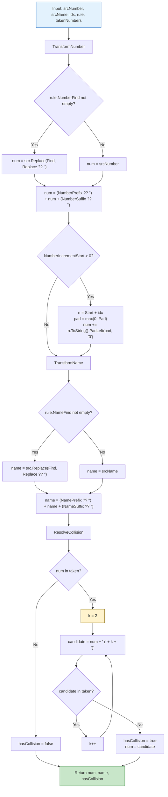
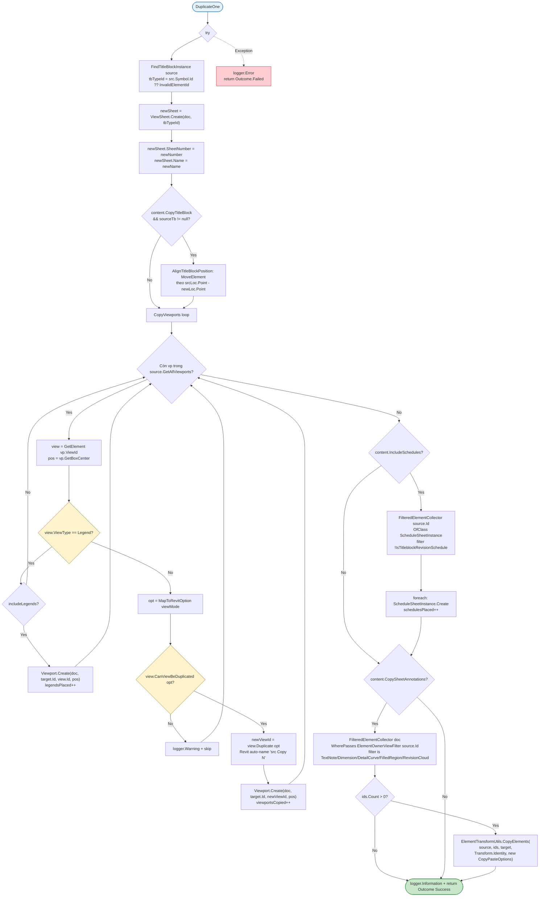
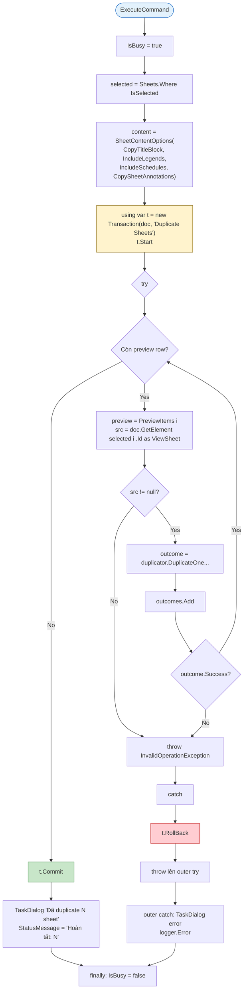
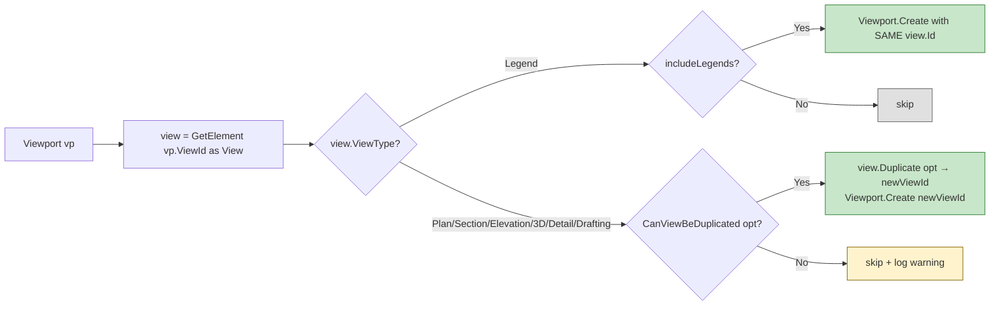
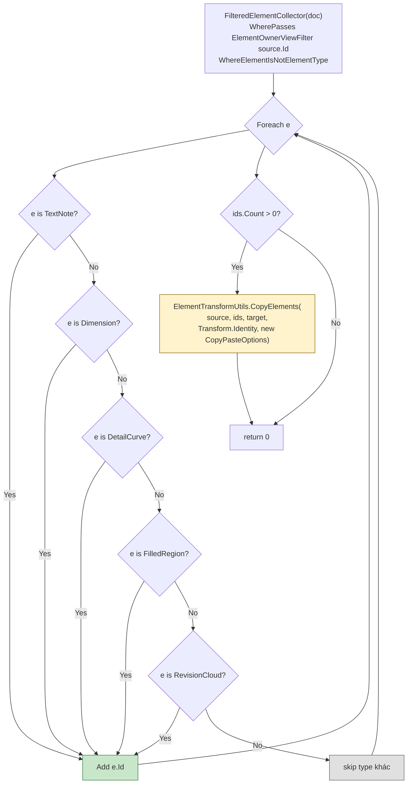
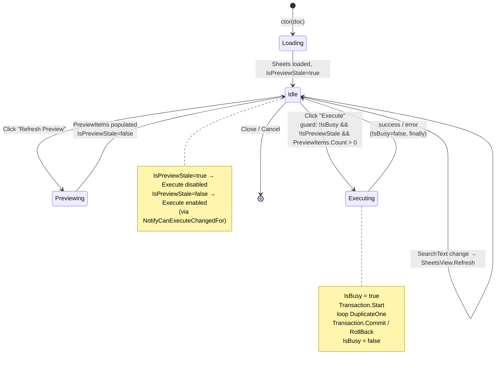

# Duplicate Sheets — Algorithm & UI Review

> Status: implemented (Phase 1–8 done, 14/14 test pass, build R23–R27 pass).
> Mục đích doc: review post-implementation, đối chiếu thuật toán & UI giữa plan và code thật.
> Plan gốc: `C:\Users\NC\.claude\plans\h-y-t-o-cho-t-i-greedy-noodle.md`.

---

## 1. Cấu trúc folder + namespace (actual)

```
RevitAIApp/MyRevitAIApp/DuplicateSheet/             namespace: MyRevitAIApp.DuplicateSheet
├── DuplicateSheetsCommand.cs                       (ribbon entry, Transaction.Manual)
├── Internals/
│   └── IsExternalInitShim.cs                       (polyfill cho net48 — R23/R24)
├── Models/                                         namespace: .Models
│   ├── DuplicateMode.cs                            (enum: Duplicate / WithDetailing / AsDependent)
│   ├── NamingRule.cs                               (record 10 field + .Empty)
│   ├── SheetContentOptions.cs                      (record 4 flag + .All)
│   ├── SheetItem.cs                                (ObservableObject + IsSelected)
│   ├── PreviewItem.cs                              (record preview row)
│   └── DuplicationOutcome.cs                       (record per-sheet result)
├── Services/                                       namespace: .Services
│   ├── INamingRuleEngine.cs                        (pure-logic interface)
│   ├── NamingRuleEngine.cs                         (default impl, xUnit testable)
│   ├── ISheetDuplicator.cs                         (Revit API interface)
│   └── SheetDuplicator.cs                          (Revit API impl)
├── ViewModels/                                     namespace: .ViewModels
│   └── DuplicateSheetsViewModel.cs                 (ObservableObject + RelayCommand)
└── Views/                                          namespace: .Views
    ├── DuplicateSheetsView.xaml
    └── DuplicateSheetsView.xaml.cs                 (InitializeComponent + DataContext)
```

**File modify (1):** `Application.cs` — thêm `using` + 1 `AddPushButton<DuplicateSheetsCommand>`.

**Test project (sibling):** `RevitAIApp/MyRevitAIApp.Tests/` (xUnit, net8.0, link 3 file pure-logic).

---

## 2. High-Level Sequence (User → Ribbon → Revit)

```mermaid
sequenceDiagram
    actor U as User
    participant Ribbon as Revit Ribbon
    participant Cmd as DuplicateSheetsCommand
    participant VM as DuplicateSheetsViewModel
    participant V as DuplicateSheetsView (WPF)
    participant NRE as NamingRuleEngine
    participant SD as SheetDuplicator
    participant Doc as Revit Document

    U->>Ribbon: Click "Duplicate\nSheets"
    Ribbon->>Cmd: Execute()
    Cmd->>Cmd: doc = Application.ActiveUIDocument?.Document
    alt doc == null
        Cmd-->>U: TaskDialog "Cần mở document trước"
    else
        Cmd->>VM: new(doc)
        Note over VM: ctor: FilteredElementCollector load Sheets,<br/>setup ICollectionView, subscribe<br/>SheetItem.PropertyChanged
        Cmd->>V: new(vm); WindowInteropHelper.Owner = MainWindowHandle
        Cmd->>V: ShowDialog()  [modal]
    end

    loop User config
        U->>V: type SearchText
        V->>VM: SearchText setter
        VM->>VM: SheetsView.Refresh()
        U->>V: tick checkbox sheet
        V->>VM: SheetItem.IsSelected = true
        VM->>VM: OnSheetItemSelectionChanged → IsPreviewStale = true
        U->>V: edit naming field
        V->>VM: NumberPrefix/Suffix/... setter
        VM->>VM: partial OnXxxChanged → MarkPreviewStale
    end

    U->>V: Click "Refresh Preview"
    V->>VM: RefreshPreviewCommand
    VM->>VM: BuildNamingRule() từ 10 field
    VM->>Doc: GetExistingSheetNumbers() (FilteredElementCollector)
    loop For each selected sheet
        VM->>NRE: Apply(srcNumber, srcName, i, rule, taken)
        NRE-->>VM: (newNumber, newName, hasCollision)
        VM->>VM: PreviewItems.Add(...)
    end
    VM-->>V: PreviewItems binding refresh
    VM->>VM: IsPreviewStale = false

    U->>V: Click "Execute"
    V->>VM: ExecuteCommand
    VM->>Doc: Transaction "Duplicate Sheets" .Start()
    loop For each preview row
        VM->>SD: DuplicateOne(doc, source, newNumber, newName, mode, content)
        SD->>Doc: ViewSheet.Create / Viewport.Create / View.Duplicate / ScheduleSheetInstance.Create / CopyElements
        SD-->>VM: DuplicationOutcome
        alt outcome.Success == false
            VM->>Doc: t.RollBack()
            VM-->>V: TaskDialog error
        end
    end
    VM->>Doc: t.Commit()
    VM-->>V: TaskDialog "Đã duplicate N sheet"
```

---

## 3. NamingRuleEngine.Apply() — Pure-Logic Pipeline



**Đối chiếu code:**
- Source: [NamingRuleEngine.cs](../RevitAIApp/MyRevitAIApp/DuplicateSheet/Services/NamingRuleEngine.cs)
- 3 helper method `TransformNumber` / `TransformName` / `ResolveCollision` — match flowchart 1:1.
- Caller (`DuplicateSheetsViewModel.RefreshPreview`) pass `HashSet<string>(..., StringComparer.OrdinalIgnoreCase)` → collision check case-insensitive.

**Test coverage:** 14 case (file `MyRevitAIApp.Tests/DuplicateSheet/NamingRuleEngineTests.cs`):
1. Empty rule → unchanged
2. NumberPrefix
3. NumberSuffix
4. NumberFindReplace
5. NumberFindReplace với null Replace (= remove Find)
6. NumberIncrement (start + idx)
7. NumberIncrement với pad
8. All number rules apply in order (Find→Replace → Prefix/Suffix → Increment)
9. Name rules transform independently
10. NameFind không match → name unchanged
11. NumberCollision auto append `(2)`
12. Multiple collision tìm free slot
13. Number-only rule → name unchanged
14. No collision flag khi number free

---

## 4. SheetDuplicator.DuplicateOne() — Per-Sheet Algorithm



**Key behavior:**
- Legend → place same view.Id (không duplicate, legend share cross-sheet — Revit convention).
- View khác → guard `CanViewBeDuplicated` trước Duplicate → skip + log warning nếu fail (vd dependent + AsDependent mode).
- Schedule placed `IsTitleblockRevisionSchedule = true` bị filter out (auto-tạo bởi titleblock).
- Annotation: whitelist 5 type, dùng `ElementOwnerViewFilter` để chỉ lấy sheet-owned (không lẫn model element xuyên viewport).

**Source:** [SheetDuplicator.cs](../RevitAIApp/MyRevitAIApp/DuplicateSheet/Services/SheetDuplicator.cs)

---

## 5. Batch Execute Transaction (Atomic)



**Atomicity:** 1 Transaction wrap toàn batch — fail giữa chừng = rollback all (kể cả sheet đã tạo trước đó). Ctrl+Z sau commit = 1 undo step duy nhất.

**Source:** `ExecuteBatch()` trong [DuplicateSheetsViewModel.cs:135-165](../RevitAIApp/MyRevitAIApp/DuplicateSheet/ViewModels/DuplicateSheetsViewModel.cs).

---

## 6. Viewport Classification Decision Tree



**Tại sao Legend khác:**
- Revit cho 1 Legend xuất hiện trên nhiều sheet cùng lúc (đặc thù legend type).
- `Viewport.Create` với cùng view.Id lên sheet khác → OK với legend, fail với view thường.
- Nếu `Duplicate` legend → tạo legend mới (không phải ý user muốn cho "duplicate sheet").

**View name policy:** KHÔNG rename — Revit tự đặt `<srcName> Copy 1/2/3...` auto-incrementing → không bao giờ `ArgumentException`.

---

## 7. Sheet-Level Annotation Whitelist



**Tại sao whitelist (không blacklist):**
- ElementOwnerViewFilter trả về cả Viewport + ScheduleSheetInstance + TitleBlock instance + tag không host trên sheet — không phải tất cả đều copy được.
- Whitelist 5 type quen thuộc (Text/Dim/DetailCurve/FilledRegion/RevisionCloud) đủ 90% nhu cầu annotation đặt trực tiếp trên sheet.
- IndependentTag bị skip (tag cần host element, không copy độc lập được).

---

## 8. ViewModel State Machine



**Guard cho `ExecuteCommand.CanExecute()`:**
```csharp
!IsBusy
&& !IsPreviewStale
&& PreviewItems.Count > 0
&& PreviewItems.All(p => !p.IsBlockingError);
```

---

## 9. UI Mockup (actual XAML layout)

Window 1100×720, min 900×560, ResizeMode=CanResize, WindowStartupLocation=CenterScreen, Owner=Revit main window:

```
┌── Duplicate Sheets ───────────────────────────────────── [_] [□] [×] ┐
│                                                                       │
│ ┌─ Search/Total bar ───────────────────────────────────────────────┐ │
│ │ [Filter by sheet number or name________________]      Total: 47  │ │
│ └──────────────────────────────────────────────────────────────────┘ │
│                                                                       │
│ ┌── Sheets ────────────────────────┐ ┌── Options (scrollable) ────┐ │
│ │ ☑ │ Number    │ Name             │ │ ▼ Naming Rule               │ │
│ │───┼───────────┼──────────────────│ │ ┌─ Sheet Number ──────────┐ │ │
│ │ ☑ │ A101      │ Ground Floor     │ │ │ Prefix          [COPY_] │ │ │
│ │ ☑ │ A102      │ First Floor      │ │ │ Suffix          [_____] │ │ │
│ │ ☐ │ A103      │ Roof Plan        │ │ │ Find            [_____] │ │ │
│ │ ☐ │ A201      │ Section A-A      │ │ │ Replace         [_____] │ │ │
│ │ ☐ │ A202      │ Section B-B      │ │ │ Increment start [0____] │ │ │
│ │ ☐ │ A301      │ Elevations       │ │ │ Increment pad   [0____] │ │ │
│ │ ☐ │ A401      │ Details          │ │ └─────────────────────────┘ │ │
│ │ ☐ │ A501      │ 3D Views         │ │ ┌─ Sheet Name ────────────┐ │ │
│ │ ☐ │ ...       │ ...              │ │ │ Prefix          [_____] │ │ │
│ │   │           │                  │ │ │ Suffix          [_____] │ │ │
│ │   │           │                  │ │ │ Find            [_____] │ │ │
│ │   │           │                  │ │ │ Replace         [_____] │ │ │
│ │   │           │                  │ │ └─────────────────────────┘ │ │
│ │   │           │                  │ │                              │ │
│ │   │           │                  │ │ ▼ View Duplicate Mode        │ │
│ │   │           │                  │ │ [ WithDetailing       ▼ ]    │ │
│ │   │           │                  │ │                              │ │
│ │   │           │                  │ │ ▼ Include in new sheet       │ │
│ │   │           │                  │ │ ☑ Title block (align pos)    │ │
│ │   │           │                  │ │ ☑ Legends (placed ref)       │ │
│ │   │           │                  │ │ ☑ Schedules                  │ │
│ │   │           │                  │ │ ☑ Sheet-level annotations    │ │
│ └──────────────────────────────────┘ └──────────────────────────────┘ │
│                                                                       │
│ ┌── Preview ────────────────────────────────────────────────────────┐ │
│ │ Source #│ Source Name      │ New #        │ New Name      │Status│ │
│ │─────────┼──────────────────┼──────────────┼───────────────┼──────│ │
│ │ A101    │ Ground Floor     │ COPY_A101    │ Ground Floor  │ OK   │ │
│ │ A102    │ First Floor      │ COPY_A102 (2)│ First Floor   │ Trùng│ │
│ │         │                  │              │               │      │ │
│ └────────────────────────────────────────────────────────────────────┘ │
│                                                                       │
│ ┌── Bottom bar ─────────────────────────────────────────────────────┐ │
│ │ [Refresh Preview]   Preview: 2 sheet sẽ được duplicate.           │ │
│ │                                              [Cancel] [Execute]   │ │
│ └────────────────────────────────────────────────────────────────────┘ │
└───────────────────────────────────────────────────────────────────────┘
```

**Resize behavior:**
- Sheets DataGrid (cột Name): width="*" → giãn theo window.
- Options panel (right): fixed width 400px.
- Preview DataGrid: height fixed 220px.
- Toolbar + Bottom bar: height Auto.

**Styling:** WPF default brushes (không có Theme.xaml v1 — defer plan riêng).

---

## 10. Bindings Map (ViewModel ↔ XAML)

| ViewModel property | Mode | XAML element |
|---|---|---|
| `Sheets` (collection) | one-way | n/a (raw collection) |
| `SheetsView` (ICollectionView) | one-way | `DataGrid.ItemsSource` (sheet list) |
| `Sheets.Count` | one-way | `TextBlock` "Total: {0}" |
| `SearchText` | two-way (PropChange) | `TextBox` filter |
| `SheetItem.IsSelected` | two-way (PropChange) | `CheckBox` trong template column |
| `SheetItem.Number/Name` | one-way | DataGridTextColumn |
| `NumberPrefix/Suffix/Find/Replace` | two-way (PropChange) | 4 `TextBox` |
| `NumberIncrementStart/Pad` | two-way (PropChange) | 2 `TextBox` |
| `NamePrefix/Suffix/Find/Replace` | two-way (PropChange) | 4 `TextBox` |
| `AvailableModes` | one-way | `ComboBox.ItemsSource` |
| `SelectedMode` | two-way | `ComboBox.SelectedItem` |
| `CopyTitleBlock` | two-way | `CheckBox` |
| `IncludeLegends` | two-way | `CheckBox` |
| `IncludeSchedules` | two-way | `CheckBox` |
| `CopySheetAnnotations` | two-way | `CheckBox` |
| `PreviewItems` | one-way | `DataGrid.ItemsSource` (preview) |
| `RefreshPreviewCommand` | command | `Button` "Refresh Preview" |
| `ExecuteCommand` | command | `Button` "Execute" |
| `StatusMessage` | one-way | `TextBlock` bottom bar |
| `IsBusy` | (internal) | gate disable Execute/RefreshPreview |
| `IsPreviewStale` | (internal) | gate disable Execute |

**`CanExecute` chain (via `[NotifyCanExecuteChangedFor]`):**
- `IsBusy` change → re-eval `RefreshPreviewCommand.CanExecute` + `ExecuteCommand.CanExecute`
- `IsPreviewStale` change → re-eval `ExecuteCommand.CanExecute`

---

## 11. Verification Status

| Phase | Verify command | Result |
|---|---|---|
| 1 | `dotnet build -c Debug.R27` (after Models) | ✅ 0 warn, 0 err |
| 2 | `dotnet build -c Debug.R27` (after NamingRuleEngine) | ✅ 0/0 |
| 3 | `dotnet build -c Debug.R27` (after SheetDuplicator) | ✅ 0/0 |
| 4 | `dotnet build -c Debug.R27` (after VM) | ✅ 0/0 |
| 5 | `dotnet build -c Debug.R27` (after XAML) | ✅ 0/0 |
| 6 | `dotnet build -c Debug.R27` (after Command + Application wire) | ✅ 0/0 (fix CS0618 obsolete) |
| 7 | `dotnet test MyRevitAIApp.Tests` | ✅ 14/14 pass |
| 8 | Build R23/R24/R25/R26/R27 | ✅ all 5 pass (fix IsExternalInit polyfill cho net48) |

**Còn lại (manual user action):**
- F5 smoke test trong Revit thực (12 bước plan §8) — cần Revit installed + sample document có viewport/legend/schedule/sheet-annotation đa dạng.
- Build outputs đã auto-deploy về `%AppData%\Autodesk\Revit\Addins\2027\` (qua `<DeployAddin>true</DeployAddin>`).

---

## 12. Open Questions / Known Limitations

1. **Title block alignment** chỉ dùng `MoveElement` theo `LocationPoint` — nếu titleblock có rotation, có thể không match. v1 chấp nhận, v2 thêm rotation copy.
2. **Dependent view của source sheet**: nếu source có 1 viewport là dependent view + 1 viewport là primary của cùng cây, cả 2 đều cố gắng duplicate (CanViewBeDuplicated guard) → có thể tạo 2 viewport mới có relationship khác source. Behavior chấp nhận, log warning nếu fail.
3. **Legend ID drift**: nếu user xóa legend gốc sau khi duplicate sheet → sheet mới mất legend (vì share reference). Đây là behavior Revit native, không phải bug.
4. **R23/R24 vs R25–R27**: record với `init` accessor + `with` expression chạy trên net48 nhờ polyfill `IsExternalInitShim` — runtime behavior identical net8.0.
