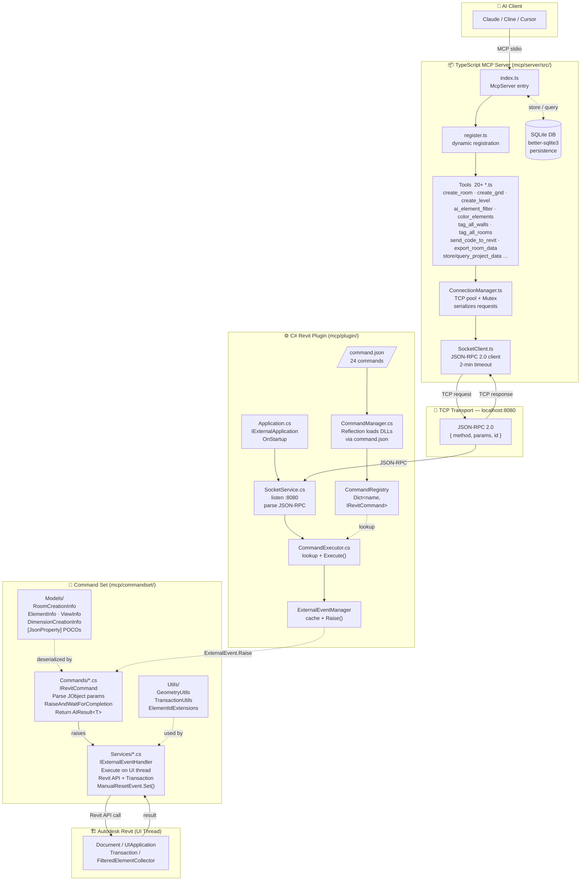

# Revit MCP — Overall Architecture



## Luồng chính (request → response)

```
AI  →[stdio]→  index.ts  →  Tool.ts  →  ConnectionManager (Mutex)
→  SocketClient  →[TCP :8080]→  SocketService  →  CommandExecutor
→  IRevitCommand.Execute()  →  ExternalEventManager.Raise()
→  IExternalEventHandler (UI thread)  →  Revit API  →  Transaction
→  Result  →  ManualResetEvent.Set()  →  AIResult<T>
→  JSON-RPC response  →[TCP]→  SocketClient  →  MCP response  →  AI
```

## 3 điểm kiến trúc quan trọng

| Vấn đề | Giải pháp |
|--------|-----------|
| Revit API chỉ gọi được từ UI thread | `IExternalEventHandler` + `ExternalEvent.Raise()` |
| TS gửi nhiều request song song | `Mutex` trong `ConnectionManager` serializes chúng |
| Đăng ký command động | `command.json` → `CommandManager` (Reflection) → `CommandRegistry` |

## Cấu trúc thư mục

```
mcp/
├── command.json                  # Registry manifest (24 commands)
├── server/src/
│   ├── index.ts                  # McpServer entry, stdio transport
│   ├── tools/
│   │   ├── register.ts           # Dynamic tool loader
│   │   └── *.ts                  # 20+ tool definitions (Zod schema)
│   ├── utils/
│   │   ├── ConnectionManager.ts  # TCP pool + Mutex
│   │   └── SocketClient.ts       # JSON-RPC 2.0 TCP client
│   └── database/
│       └── service.ts            # SQLite persistence
├── plugin/
│   └── Core/
│       ├── Application.cs        # IExternalApplication entry
│       ├── SocketService.cs      # TCP listener :8080
│       ├── CommandManager.cs     # Reflection DLL loader
│       ├── RevitCommandRegistry.cs
│       ├── CommandExecutor.cs
│       └── ExternalEventManager.cs
└── commandset/
    ├── Commands/                 # IRevitCommand implementations
    ├── Services/                 # IExternalEventHandler implementations
    ├── Models/                   # [JsonProperty] POCOs
    └── Utils/                    # Geometry, Transaction helpers
```
