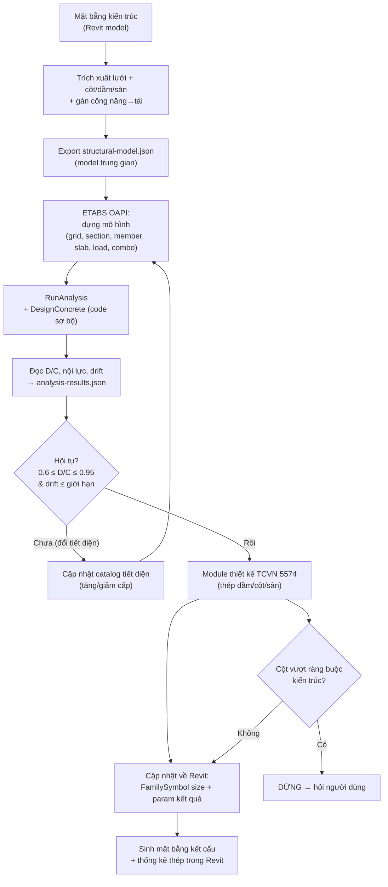
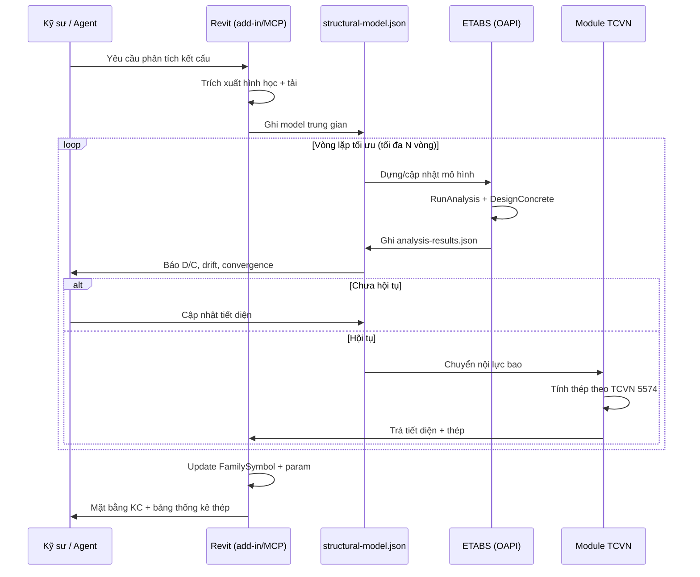
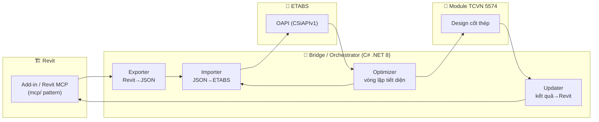

# Đề Xuất Mặt Bằng Kết Cấu & Quy Trình Tự Động Hóa Tính Toán Revit ↔ ETABS

> **Đầu vào:** Mặt bằng kiến trúc tầng trệt nhà phố — lưới trục 1–6, dài 17.500mm, rộng ~5.000mm (Phòng khách → Cầu thang → WC → Bếp → Phòng ăn → Sân rửa).
> **Giả thiết công trình:** Trệt + 3 lầu + tum/mái ≈ **5 cao trình sàn** (thiết kế cho cận trên; scale xuống được cho phương án 2 lầu — xem §3.4).
> **Tiêu chuẩn:** Tải trọng **TCVN 2737:2023**, BTCT **TCVN 5574:2018**, (động đất tùy chọn TCVN 9386:2012).
> **Phạm vi tài liệu:** Đề xuất kết cấu sơ bộ + quy trình tự động hóa Revit↔ETABS (chưa viết code).
> **Ngày:** 2026-06-14

---

## Mục lục

1. [Phân tích mặt bằng kiến trúc](#1-phân-tích-mặt-bằng-kiến-trúc)
2. [Hệ kết cấu đề xuất](#2-hệ-kết-cấu-đề-xuất)
3. [Mặt bằng kết cấu & sơ bộ tiết diện](#3-mặt-bằng-kết-cấu--sơ-bộ-tiết-diện)
4. [Tải trọng & tổ hợp (TCVN)](#4-tải-trọng--tổ-hợp-tcvn)
5. [Kiến trúc tự động hóa Revit ↔ ETABS](#5-kiến-trúc-tự-động-hóa-revit--etabs)
6. [Lược đồ JSON model trung gian](#6-lược-đồ-json-model-trung-gian)
7. [Ánh xạ ETABS OAPI (API CSI)](#7-ánh-xạ-etabs-oapi-api-csi)
8. [Vòng lặp tối ưu tiết diện](#8-vòng-lặp-tối-ưu-tiết-diện)
9. [Module thiết kế TCVN (ETABS không có sẵn)](#9-module-thiết-kế-tcvn-etabs-không-có-sẵn)
10. [Phương án MCP vs API trực tiếp](#10-phương-án-mcp-vs-api-trực-tiếp)
11. [Sơ đồ workflow (Mermaid)](#11-sơ-đồ-workflow-mermaid)
12. [Lộ trình triển khai](#12-lộ-trình-triển-khai)
13. [Rủi ro & lưu ý kỹ thuật](#13-rủi-ro--lưu-ý-kỹ-thuật)
14. [Câu hỏi mở](#14-câu-hỏi-mở)

---

## 1. Phân tích mặt bằng kiến trúc

### 1.1 Lưới trục (đọc từ bản vẽ)

**Phương dọc nhà (trục số 1→6, tổng 17.500mm — chiều sâu nhà từ mặt tiền vào):**

| Khoảng | Trục 1–2 | Trục 2–3 | Trục 3–4 | Trục 4–5 | Trục 5–6 | **Tổng** |
|---|---|---|---|---|---|---|
| Bước (mm) | 4000 | 3800 | 3200 | 3800 | 2700 | **17500** |

**Phương ngang nhà (trục chữ A↔B, ~5.000mm — chiều rộng lô):** 1 nhịp ngang ≈ 5000mm (chuẩn nhà phố hẹp-dài). Đề xuất 2 trục biên **A** (tường trái) và **B** (tường phải).

### 1.2 Phân vùng công năng → ràng buộc kết cấu

| Vùng | Trục | Ràng buộc kết cấu |
|---|---|---|
| Phòng khách | 1–3 | Nhịp thông thoáng, **không cột giữa** → dầm ngang span 5m |
| Cầu thang | 3–4 (3200) | **Lỗ mở sàn** → cần dầm bo lỗ thang + dầm chiếu nghỉ |
| WC1 | gần trục 4 | **Hạ cốt sàn (sunken) ~50mm**, dầm bo khu WC, chống thấm |
| Bếp | 4–5 | Tải hoạt tải bếp; bệ bếp = tải tường/line load |
| Phòng ăn | gần trục 5 | Bình thường |
| Sân rửa / giếng trời | 5–6 (2700) | Có thể là **sân sau/thông tầng** → sàn hở hoặc sàn thường, thoát nước |

> **Nguyên tắc phối hợp KT-KC:** cột giấu trong tường biên 2 bên (không lòi vào phòng), dầm chạy trùng tường ngăn, lỗ thang được bao bằng dầm — không để cột rơi giữa cửa đi hoặc giữa phòng khách.

---

## 2. Hệ kết cấu đề xuất

**Hệ khung bê tông cốt thép toàn khối (BTCT đổ tại chỗ)** — phù hợp nhà phố 2–4 tầng:

```
Cột (column)  →  Dầm chính ngang + dầm dọc giằng (beam)  →  Sàn 2 phương (slab)  →  Móng
```

- **Cột:** 2 hàng dọc theo 2 trục biên A & B, đặt tại mỗi giao điểm trục số (1–6) → khung phẳng ngang 5m lặp lại 6 lần, liên kết dọc bằng dầm giằng.
- **Dầm chính ngang (dầm khung):** nối A–B tại từng trục số, nhịp 5m — đỡ sàn & truyền tải vào cột.
- **Dầm dọc / giằng:** chạy theo trục A và B nối các cột theo phương dọc nhà — tăng độ cứng khung dọc, đỡ tường biên.
- **Sàn:** BTCT 2 phương, kê 4 cạnh trên dầm.
- **Móng:** mặc định **móng cọc ép BTCT** (đài đơn 1–2 cọc dưới cột + giằng móng) cho nhà 4 tầng; nếu địa chất tốt và ≤2 tầng → **móng băng 1 phương** dọc 2 trục biên. *(Quyết định cuối phụ thuộc báo cáo khảo sát địa chất — xem §14.)*

**Vật liệu đề xuất:**

| Cấu kiện | Bê tông | Cốt thép chịu lực | Cốt đai |
|---|---|---|---|
| Cột, dầm, sàn | **B25** (M350, Rb≈14.5 MPa) | **CB400-V** (Rs=350 MPa) | CB240-T |
| Móng | B25 | CB400-V | CB240-T |

---

## 3. Mặt bằng kết cấu & sơ bộ tiết diện

### 3.1 Sơ đồ mặt bằng kết cấu (định vị cột – dầm – sàn)

```
          Tr1        Tr2        Tr3        Tr4        Tr5        Tr6
   (mặt tiền)  4000      3800       3200       3800       2700  (sân sau)
            |----------|----------|----------|----------|----------|
   Trục A   ●==========●==========●====●—————●==========●==========●   ┐
   (tường   ‖          ‖          ‖   [LỖ ]   ‖          ‖          ‖   │
    trái)   ‖   S1     ‖   S2     ‖  [THANG]  ‖   S4     ‖   S5     ‖  ~5000
            ‖ 5x4.0    ‖ 5x3.8    ‖  + DB bo  ‖ 5x3.8    ‖ 5x2.7    ‖   │
   Trục B   ●==========●==========●====●—————●==========●==========●   ┘
   (tường
    phải)

   Ký hiệu:  ●  Cột           ===  Dầm dọc/giằng (trục A,B)
             ‖  Dầm chính ngang (trục 1..6, nhịp 5m)
             —  Dầm bo lỗ thang (DB)        S#  Ô sàn 2 phương
```

- **12 cột** = 2 trục biên (A,B) × 6 trục số. (Cầu thang nằm trong ô 3–4, **không** thêm/bớt cột — chỉ thêm dầm bo lỗ + dầm chiếu nghỉ.)
- **Dầm chính ngang:** 6 dầm (trục 1–6), nhịp 5m.
- **Dầm dọc giằng:** 2 dải (trục A, B), các nhịp 4.0/3.8/3.2/3.8/2.7m.
- **Ô sàn:** S1(5×4.0), S2(5×3.8), S3=ô thang (3.2, có lỗ), S4(5×3.8), S5(5×2.7).

### 3.2 Bảng sơ bộ tiết diện (Trệt + 3 lầu + tum)

| Cấu kiện | Vị trí / tầng | Tiết diện sơ bộ (mm) | Cơ sở chọn |
|---|---|---|---|
| **Cột biên** | Trệt – Lầu 1 | **200 × 400** | N≈600–800kN; bề rộng 200 giấu trong tường, 400 theo phương dọc tăng cứng |
| **Cột biên** | Lầu 2 – Lầu 3 | 200 × 300 | Tải giảm theo tầng |
| **Cột** | Tum | 200 × 200 | Tải nhẹ |
| **Cột giữa** (nếu bổ sung) | Trệt – Lầu 1 | 300 × 300 | Diện chịu tải lớn nhất ~17.5m² |
| **Dầm chính ngang** | Mọi tầng (span 5m) | **200 × 400** | h ≈ L/12 = 5000/12 ≈ 420 |
| **Dầm dọc / giằng** | Mọi tầng (span ≤4m) | 200 × 350 | h ≈ L/12 = 4000/12 ≈ 330 |
| **Dầm bo lỗ thang (DB)** | Quanh lỗ thang | 200 × 400 | Chịu phản lực bản thang |
| **Dầm chiếu nghỉ** | Cầu thang | 200 × 300 | — |
| **Sàn S1,S2,S4** | nhịp ≤4m | **h = 100** | h ≈ L_ngắn/40 |
| **Sàn S5** (5×2.7) | 1 phương | h = 100 | — |
| **Bản thang** | Cầu thang | h = 120 | — |
| **Giằng móng** | — | 200 × 400 ~ 300 × 500 | Theo phương án móng |

> Đây là **tiết diện khởi tạo** để dựng mô hình ETABS. Tiết diện cuối cùng do **vòng lặp tối ưu §8** quyết định dựa trên D/C ratio và kết quả TCVN.

### 3.3 Ước lượng tải trục cột (kiểm tra sơ bộ cột giữa)

```
Diện chịu tải cột giữa lớn nhất ≈ (3.8+3.2)/2 × 5.0 ≈ 17.5 m²
N (5 cao trình) ≈ 17.5 m² × 5 × 13 kN/m²  ≈  1.140 kN
A_yc ≈ k·N/Rb = 1.2 × 1140 / 14500 kN/m² ≈ 0.094 m²  → 300×300=0.09 m² (đạt, kiểm tra lại bằng ETABS)
```

### 3.4 Scale cho phương án ít tầng hơn

| Phương án | Cột biên Trệt | Dầm chính | Sàn | Móng |
|---|---|---|---|---|
| Trệt + 3 lầu + tum | 200×400 | 200×400 | 100 | Cọc ép |
| Trệt + 2 lầu | 200×300 | 200×350 | 100 | Băng / cọc |
| Trệt + 1 lầu | 200×250 | 200×300 | 100 | Băng / đơn |

---

## 4. Tải trọng & tổ hợp (TCVN)

### 4.1 Tĩnh tải (TT / Dead)

| Thành phần | Giá trị | Gán vào |
|---|---|---|
| Trọng lượng bản thân | tự động (ETABS self-weight) | toàn mô hình |
| Hoàn thiện sàn (lát gạch, vữa, trần) | 1.0 – 1.5 kN/m² | tải phân bố đều trên ô sàn |
| Tường xây trên dầm (gạch, tường 200, cao ~3m) | ≈ 10.8 kN/m | line load trên dầm |
| Tường 100 | ≈ 5.4 kN/m | line load trên dầm |
| Lớp chống thấm + tạo dốc WC | +0.5 – 1.0 kN/m² | ô sàn WC |

### 4.2 Hoạt tải (HT / Live) — TCVN 2737:2023

| Khu vực | HT tiêu chuẩn (kN/m²) |
|---|---|
| Phòng khách, phòng ngủ, phòng ăn | 1.5 |
| Bếp | 1.5 – 2.0 |
| WC | 1.5 |
| **Cầu thang, hành lang, sảnh** | **3.0** |
| Ban công / lô gia | 2.0 – 4.0 |
| Mái BTCT (không người) | 0.75 – 1.5 |

### 4.3 Tải gió — TCVN 2737:2023

- Áp lực gió W₀ theo **vùng gió** địa phương (tra theo địa điểm xây dựng — xem §14), hệ số k(z) theo độ cao, hệ số khí động c.
- Nhà phố ≤4 tầng: gió thường không khống chế nhưng **bắt buộc kiểm tra chuyển vị ngang** và tổ hợp gió cho cột/dầm khung biên (đặc biệt phương dọc nhà mảnh).

### 4.4 Tổ hợp tải trọng (Load Combinations)

Hệ số độ tin cậy về tải TCVN 2737: tĩnh tải n≈1.1 ; hoạt tải n≈1.2 (1.3 nếu HT<2 kN/m²); hệ số tổ hợp ψ khi nhiều hoạt tải.

| Tên | Tổ hợp | Mục đích |
|---|---|---|
| COMB1 (cơ bản) | 1.1·TT + 1.2·HT | Cường độ — uốn/nén |
| COMB2 (gió X) | 1.1·TT + 1.2·(ψ·HT) + 1.2·GIO_X | Cường độ + gió |
| COMB3 (gió Y) | 1.1·TT + 1.2·(ψ·HT) + 1.2·GIO_Y | Cường độ + gió |
| COMB_SLS | 1.0·TT + 1.0·HT | Sử dụng — độ võng / chuyển vị |
| ENVE | bao COMB1..3 | Bao nội lực thiết kế |

> **Lưu ý quan trọng:** ETABS không có **TCVN concrete design code** native. Dùng ETABS để **phân tích nội lực** + auto-design sơ bộ bằng code gần (ACI/Euro) cho vòng lặp sizing; **thiết kế cốt thép chính thức theo TCVN 5574 làm ở module riêng §9**.

---

## 5. Kiến trúc tự động hóa Revit ↔ ETABS

### 5.1 Nguyên tắc

- **Revit = nguồn chân lý hình học** (lưới, cột, dầm, sàn, công năng → tải).
- **ETABS = engine phân tích** (nội lực, chuyển vị, D/C, auto-section).
- **Module TCVN = engine thiết kế cốt thép** (lấy nội lực từ ETABS → tính thép theo TCVN 5574).
- **JSON model trung gian** = lớp decouple giữa Revit & ETABS (không phụ thuộc trực tiếp lẫn nhau, dễ test, dễ version).

### 5.2 Các thành phần

```
┌─────────────┐   export    ┌──────────────────┐   build    ┌──────────────┐
│   REVIT     │ ──────────► │  structural-     │ ─────────► │    ETABS     │
│  (add-in /  │   JSON      │  model.json      │  OAPI      │  (OAPI .NET) │
│  Revit MCP) │             │  (model trung    │            │              │
│             │ ◄────────── │   gian)          │ ◄───────── │              │
└─────────────┘   update    └──────────────────┘  results   └──────────────┘
      ▲              FamilySymbol size       analysis-results.json    │
      │              + params kết quả                                 │
      │                                                               ▼
      │                                                    ┌──────────────────┐
      └────────────────────────────────────────────────── │  Module TCVN     │
                       cốt thép / tiết diện chốt           │  (thiết kế 5574) │
                                                           └──────────────────┘
```

### 5.3 Hai cách hiện thực orchestration

1. **Pipeline app (C# .NET 8)** — 1 chương trình console/library gọi tuần tự Revit API (qua add-in) + ETABS OAPI. Deterministic, CI-friendly. *(Khuyến nghị cho production.)*
2. **MCP-driven** — Claude/agent điều phối **Revit MCP** (đã có trong `mcp/`) + **ETABS MCP** (xây mới theo cùng pattern). Hội thoại, linh hoạt, prototype nhanh. *(So sánh chi tiết §10.)*

---

## 6. Lược đồ JSON model trung gian

File `structural-model.json` — hợp đồng dữ liệu giữa Revit và ETABS (đơn vị: m, kN):

```jsonc
{
  "project": { "name": "NhaPho_17m5", "units": "kN_m_C", "code": "TCVN", "stories": 5 },
  "materials": [
    { "name": "B25", "type": "concrete", "fc": 25, "E": 30000000 },
    { "name": "CB400V", "type": "rebar", "fy": 400000 }
  ],
  "grids": {
    "x": [0, 4.0, 7.8, 11.0, 14.8, 17.5],          // trục 1..6
    "y": [0, 5.0],                                  // trục A,B
    "labels_x": ["1","2","3","4","5","6"],
    "labels_y": ["A","B"]
  },
  "stories": [
    { "name": "TRET", "elevation": 0.0, "height": 3.6 },
    { "name": "LAU1", "elevation": 3.6, "height": 3.3 },
    { "name": "LAU2", "elevation": 6.9, "height": 3.3 },
    { "name": "LAU3", "elevation": 10.2, "height": 3.3 },
    { "name": "TUM",  "elevation": 13.5, "height": 3.0 }
  ],
  "sections": {
    "frame": [
      { "name": "C200x400", "shape": "rect", "b": 0.2, "h": 0.4, "mat": "B25", "role": "column" },
      { "name": "B200x400", "shape": "rect", "b": 0.2, "h": 0.4, "mat": "B25", "role": "beam" },
      { "name": "B200x350", "shape": "rect", "b": 0.2, "h": 0.35, "mat": "B25", "role": "beam" }
    ],
    "slab": [ { "name": "S100", "t": 0.1, "mat": "B25" } ]
  },
  "columns": [
    { "id": "C-A1", "x": 0, "y": 0, "story": "TRET", "section": "C200x400", "revit_id": 123456 }
    // ... A1..A6, B1..B6 cho từng tầng
  ],
  "beams": [
    { "id": "BX-1", "p1": [0,0], "p2": [0,5.0], "story": "LAU1", "section": "B200x400", "revit_id": 234567 }
    // ... dầm ngang + dầm dọc
  ],
  "slabs": [
    { "id": "S1", "poly": [[0,0],[4.0,0],[4.0,5.0],[0,5.0]], "story": "LAU1", "section": "S100",
      "opening": null, "load_finish": 1.5, "load_live": 1.5 }
    // ... S2..S5, S3 có "opening" cho lỗ thang
  ],
  "loads": {
    "patterns": [
      { "name": "TT", "type": "Dead", "selfweight": 1.0 },
      { "name": "HT", "type": "Live", "selfweight": 0.0 },
      { "name": "GIO_X", "type": "Wind" }, { "name": "GIO_Y", "type": "Wind" }
    ],
    "wall_lines": [ { "on_beam": "BX-1", "value": 10.8, "pattern": "TT" } ]
  },
  "supports": [ { "node": "C-A1@TRET", "restraint": [true,true,true,true,true,true] } ],
  "combos": [
    { "name": "COMB1", "type": "linearAdd", "cases": [["TT",1.1],["HT",1.2]] }
  ]
}
```

File kết quả `analysis-results.json` (ETABS → Revit/TCVN):

```jsonc
{
  "frames": [
    { "id": "C-A1", "section": "C200x400",
      "DC_ratio": 0.82, "N_max": -640.5, "M2_max": 35.1, "M3_max": 48.7, "V_max": 22.0,
      "design": { "As_required_cm2": 12.4, "rebar_suggest": "4T16+2T14", "status": "OK" } }
  ],
  "drift": { "story_max": "LAU3", "value": 1/720, "limit": 1/500, "status": "OK" },
  "convergence": { "iteration": 3, "max_DC": 0.94, "changed_sections": 2 }
}
```

---

## 7. Ánh xạ ETABS OAPI (API CSI)

ETABS Open API (`CSiAPIv1` / `ETABSv1.dll`) là COM, gọi được từ **C# (.NET)** — khớp stack add-in (R25–R27 .NET 8) — hoặc **Python** (`comtypes`/`pythonnet`) để prototype nhanh.

| Bước | Đối tượng OAPI | Phương thức tiêu biểu |
|---|---|---|
| Kết nối | `cHelper`, `cOAPI` | `helper.CreateObjectProgID("CSI.ETABS.API.ETABSObject")` → `obj.ApplicationStart()` ; hoặc `GetObject` để attach ETABS đang mở |
| Khởi tạo | `cSapModel` | `model.InitializeNewModel(eUnits.kN_m_C)` ; `model.File.NewBlank()` |
| Tầng/lưới | `cStory`, `cGridSys` | `model.Story.SetStories(...)` ; định nghĩa grid |
| Vật liệu | `cPropMaterial` | `model.PropMaterial.SetMaterial("B25", eMatType.Concrete)` ; `SetOConcrete_1(...)` |
| Tiết diện frame | `cPropFrame` | `model.PropFrame.SetRectangle("B200x400","B25",0.4,0.2)` |
| Tiết diện sàn | `cPropArea` | `model.PropArea.SetSlab("S100", eSlabType.Slab, eShellType.ShellThin, "B25", 0.1)` |
| Vẽ cột/dầm | `cFrameObj` | `model.FrameObj.AddByCoord(x1,y1,z1,x2,y2,z2, ref name, "B200x400")` |
| Vẽ sàn | `cAreaObj` | `model.AreaObj.AddByCoord(n, ref x, ref y, ref z, ref name, "S100")` |
| Lỗ mở (thang) | `cAreaObj` | tạo opening / không gán slab cho vùng lỗ |
| Gối tựa | `cPointObj` | `model.PointObj.SetRestraint(pt, ref bool[6])` |
| Loại tải | `cLoadPatterns` | `model.LoadPatterns.Add("HT", eLoadPatternType.Live, 0)` |
| Gán tải sàn | `cAreaObj` | `model.AreaObj.SetLoadUniform(area,"HT", value, dir)` |
| Gán tải tường | `cFrameObj` | `model.FrameObj.SetLoadDistributed(frame,"TT",...)` |
| Tổ hợp | `cRespCombo` | `model.RespCombo.Add("COMB1",0)` ; `SetCaseList(...)` |
| Phân tích | `cAnalyze` | `model.Analyze.RunAnalysis()` |
| Thiết kế (sơ bộ) | `cDesignConcrete` | `model.DesignConcrete.SetCode("ACI 318-19")` ; `StartDesign()` ; `GetSummaryResultsColumn/Beam(...)` |
| Đọc nội lực | `cAnalysisResults` | `model.Results.Setup.SetCaseSelectedForOutput("ENVE")` ; `model.Results.FrameForce(...)` |
| Đọc chuyển vị | `cAnalysisResults` | `model.Results.StoryDrifts(...)` |

> **Cảnh báo phiên bản:** chữ ký hàm OAPI đổi giữa các bản ETABS (v18/v19/v20/v21). Pin version & wrap trong adapter để dễ migrate.

---

## 8. Vòng lặp tối ưu tiết diện

Mục tiêu: mọi cấu kiện có **0.60 ≤ D/C ≤ 0.95** (không quá tải, không lãng phí bê tông) và **chuyển vị ngang ≤ giới hạn TCVN**.

```
khởi tạo tiết diện (§3.2)
        │
        ▼
  ┌──────────────────────────────────────────────┐
  │ (1) Dựng/cập nhật mô hình ETABS từ JSON        │
  │ (2) RunAnalysis + DesignConcrete (code sơ bộ)  │
  │ (3) Đọc D/C, nội lực, drift → results.json     │
  │ (4) Kiểm tra hội tụ:                            │
  │      • D/C > 1.0   → tăng cấp tiết diện         │
  │      • D/C < 0.5   → giảm cấp (tiết kiệm)       │
  │      • drift > giới hạn → tăng cột/ thêm vách   │
  └──────────────────────────────────────────────┘
        │ còn thay đổi?
   ┌────┴─────┐
  CÓ          KHÔNG
   │            │
   └─► quay lại (1)   ▼
                 chốt tiết diện → Module TCVN (§9) → đẩy về Revit
```

**Quy tắc đổi tiết diện (catalog rời rạc, không nội suy tùy ý):**

```
Cột:  200x200 → 200x300 → 200x400 → 250x400 → 300x400 → 300x500 ...
Dầm:  200x300 → 200x350 → 200x400 → 200x450 → 250x500 ...
Sàn:  100 → 120 → 150 (mm)
```

- Điều kiện dừng: không cấu kiện nào đổi tiết diện ở vòng lặp mới **HOẶC** đạt số vòng tối đa (vd 8) → cảnh báo nếu chưa hội tụ.
- Ghi log mọi vòng (`iteration`, `max_DC`, `changed_sections`) để truy vết.
- **Không tự động đổi** tiết diện kiến trúc đã chốt (vd cột phải ≤200 để giấu tường) — nếu cần vượt, **dừng và hỏi người dùng** (xem rule guard quyết định người dùng).

---

## 9. Module thiết kế TCVN (ETABS không có sẵn)

ETABS không hỗ trợ TCVN 5574 → tách module thiết kế cốt thép riêng (C# hoặc Python), input = `analysis-results.json` (nội lực bao), output = cốt thép + kiểm tra.

| Cấu kiện | Bài toán TCVN 5574:2018 | Output |
|---|---|---|
| **Dầm** | Cấu kiện chịu uốn: As từ M, kiểm tra hàm lượng μmin/μmax, kiểm tra cắt (Q ≤ Qbt + Qsw) | As trên/dưới, đai |
| **Cột** | Nén lệch tâm xiên (N + M2 + M3), kiểm tra độ mảnh, hàm lượng thép | As tổng, bố trí thép |
| **Sàn** | Bản kê 4 cạnh (tra bảng / FEM ETABS) | As theo 2 phương, kiểm tra võng |
| **Chung** | Kiểm tra nứt & võng (SLS) theo TCVN 5574 | Đạt/không |

**Chiến lược thực dụng (3 mức, chọn theo độ trưởng thành dự án):**

1. **Mức 1 — ETABS auto-design sơ bộ (ACI/Euro)** chỉ để **chọn tiết diện** trong vòng lặp; thép cuối tính tay/Excel theo TCVN. *(Nhanh, ít code.)*
2. **Mức 2 — Module TCVN tự viết** cho dầm + cột + sàn từ nội lực ETABS. *(Khuyến nghị — tự chủ hoàn toàn theo TCVN.)*
3. **Mức 3 — Tích hợp công cụ VN** (vd workflow quen thuộc của kỹ sư) đọc nội lực ETABS. *(Tùy chọn.)*

> Tài liệu này đề xuất **Mức 2** cho production, **Mức 1** cho prototype/vòng lặp sizing.

---

## 10. Phương án MCP vs API trực tiếp

| Tiêu chí | **Pipeline C# + OAPI trực tiếp** | **MCP-driven (Revit MCP + ETABS MCP)** |
|---|---|---|
| Cách chạy | Console app / library, gọi từ CI hoặc nút bấm trong add-in | Claude/agent điều phối qua công cụ MCP |
| Quyết định | Deterministic, rule cứng | Linh hoạt, agent suy luận giữa các bước |
| Tốc độ lặp | Nhanh (không round-trip LLM) | Chậm hơn (mỗi bước qua LLM) |
| Phù hợp | **Production, batch, vòng lặp tối ưu** | **Prototype, hỏi-đáp, thao tác ad-hoc** |
| Tái dùng repo | Bridge mới | **Tái dùng `mcp/` pattern** (TS tool → TCP JSON-RPC → C# plugin → ExternalEvent) |
| Khuyến nghị | ✅ Lõi tự động hóa | ✅ Lớp điều phối + UX hội thoại |

**ETABS MCP đề xuất** — gương theo Revit MCP (`docs/mcp-architecture.md`): TS server expose tools, TCP JSON-RPC tới host process C# nhúng OAPI. Bộ tool tối thiểu:

```
etabs_create_model       etabs_define_section     etabs_add_column
etabs_add_beam           etabs_add_slab           etabs_assign_loads
etabs_define_combos      etabs_run_analysis       etabs_get_design_results
etabs_update_section     etabs_get_drift          etabs_save_model
```

> **Kiến trúc lai khuyến nghị:** lõi tính toán = **pipeline C# deterministic**; bọc thêm **MCP** để Claude điều phối "đọc Revit → chạy ETABS → cập nhật Revit" bằng hội thoại khi cần. Hai lớp dùng chung `structural-model.json` schema (§6).

---

## 11. Sơ đồ workflow (Mermaid)

### 11.1 Flowchart tổng thể



### 11.2 Sequence diagram (1 vòng lặp tối ưu)



### 11.3 Kiến trúc thành phần



---

## 12. Lộ trình triển khai

| Phase | Nội dung | Sản phẩm |
|---|---|---|
| **P0** | Chốt schema `structural-model.json` + `analysis-results.json` | 2 file schema + ví dụ |
| **P1** | Exporter Revit→JSON (đọc analytical model / lưới + tải) | Revit add-in feature `Structural Export` |
| **P2** | Importer JSON→ETABS qua OAPI (dựng mô hình tối thiểu: cột/dầm/sàn/tải/combo) | Console C# dựng mô hình chạy được |
| **P3** | RunAnalysis + đọc D/C/drift + Optimizer vòng lặp tiết diện | Optimizer hội tụ trên mô hình mẫu |
| **P4** | Module thiết kế TCVN 5574 (dầm → cột → sàn) | Thư viện tính thép + test |
| **P5** | Updater kết quả→Revit (đổi FamilySymbol + ghi param + sinh mặt bằng KC) | Revit feature `Structural Sync` |
| **P6** | (Tùy chọn) ETABS MCP + orchestration hội thoại | MCP server + tool catalog |

> Mỗi phase tuân thủ Feature Folder Convention của repo và HARD-GATE build `dotnet build -c Debug.R<XX>`. Plan chi tiết 6-phase tạo qua `/bs:plan` khi bắt đầu code.

---

## 13. Rủi ro & lưu ý kỹ thuật

| Rủi ro | Tác động | Giảm thiểu |
|---|---|---|
| ETABS không có TCVN design code | Thép không đúng tiêu chuẩn nếu dùng auto-design ACI làm cuối | Module TCVN riêng (§9), ETABS chỉ cho nội lực + sizing |
| Chữ ký OAPI đổi theo version ETABS | Code vỡ khi nâng cấp | Adapter layer + pin version |
| Analytical model Revit ≠ mô hình tính | Sai lệch hình học/trục tim | Chuẩn hóa qua JSON trung gian, đối chiếu lưới |
| Lỗ thang / hạ cốt WC / giếng trời | Mô hình sàn sai, tải sai | Xử lý opening + offset trong schema (§6) |
| Móng phụ thuộc địa chất | Chọn sai loại móng | Cần báo cáo khảo sát (§14), tách bài toán móng |
| Vòng lặp không hội tụ | Loop vô hạn | Giới hạn N vòng + cảnh báo + catalog rời rạc |
| Đổi tiết diện vi phạm kiến trúc | Cột lòi ra phòng | Guard ràng buộc KT → dừng hỏi người dùng |
| Gió/động đất bỏ sót | Thiếu an toàn nhà cao | Bắt buộc combo gió + kiểm tra drift; động đất nếu vùng yêu cầu |

---

## 14. Câu hỏi mở

1. **Số tầng chính xác?** Đang giả thiết Trệt + 3 lầu + tum (5 cao trình). Nếu là 2 lầu → giảm tiết diện theo §3.4.
2. **Địa điểm xây dựng?** Cần để xác định **vùng gió W₀** (TCVN 2737) và yêu cầu **động đất** (TCVN 9386).
3. **Báo cáo khảo sát địa chất?** Quyết định móng cọc ép vs móng băng vs móng đơn — hiện đang mặc định cọc ép cho 4 tầng.
4. **Chiều cao tầng thực tế?** Đang giả thiết trệt 3.6m, lầu 3.3m, tum 3.0m.
5. **Có cột giữa không?** Mặt bằng cho thấy nhịp ngang 5m thông — đề xuất chỉ 2 trục biên. Nếu kiến trúc cho phép cột giữa → giảm dầm/sàn.
6. **Phiên bản ETABS** đang dùng (v19/v20/v21)? Ảnh hưởng chữ ký OAPI.
7. **Ngôn ngữ bridge** ưu tiên C# (khớp add-in) hay Python (prototype nhanh)?
8. **Mức thiết kế TCVN** mong muốn: Mức 1 (sơ bộ) hay Mức 2 (module đầy đủ)?
```
